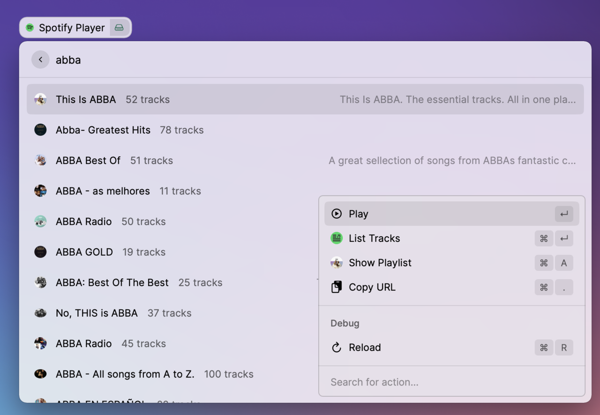

# Spotify Player for Raycast

This extension is a mini Spotify Player. Note that this ia based on beta raycast APIs and
hence in heavy development. Any kind of help in developing additional features would be welcomed.

## Setup and Installation

The setup is process is slightly involved. First you will need to create a Spotify app to
get your client ID and client secret.

Please follow the guidelines at https://developer.spotify.com/documentation/web-api/quick-start/
to get your client ID and client secret.

Please note that when creating this app, you should use `http://localhost:8888/callback` as
Redirect URIs.

This extension uses [Spotify Web API Node](https://github.com/thelinmichael/spotify-web-api-node)
library, which supports following three types of authentications:

* [Client credentials flow](http://tools.ietf.org/html/rfc6749#section-4.4) (Application-only authentication)
* [Authorization code grant](http://tools.ietf.org/html/rfc6749#section-4.1) (Signed by user)
* [Implicit Grant Flow](https://tools.ietf.org/html/rfc6749#section-4.2) (Client-side Authentication)

For full access to user data, we need to follow the **Authorization code grant** protocol. Primarily,
this flow returns a access code that expires every 60 minutes and a refresh_token that can use
used to regenerate access codes.

> For the time being, I have not been able to incorporate this initial authentication in raycast
> directly. Hence, you will need to clone this repo and run the following code just once.

The refresh_token can be generated by running the following code.

```sh
git clone https://github.com/raycast-api/api-alpha.git
cd api-alpha/extensions/spotify-player
npm install
cd src
node authenticate.js "<Client ID>" "<Client Secret>"

# This will output client_id, client_secret, access_token and refresh_token.
# you need to take note of client_id, client_secret and refresh_token as they need to be
# input to the extension preferences
```


Overall, preferences requires you to input following values:

* Client ID
* CLient Secret
* refresh_token
* Country - This is optional and defaults to US

The Country information is required for following tasks:

* Get Featured Playlists
* Get New Released Albums
* Get Artist Top Tracks

## Features


* [x] My Playlists - View all your Playlists
* [x] My Saved Albums - View all your saved Albums
* [x] Featured Playlists - Get featured playlists for your country
* [x] Recent Tracks - View all your recent tracks
* [x] New Releases - New released albums in your country
* [x] Top Artists - View top Artists from your listening history
* [x] Top Songs  - View top songs from your linstening history
* [x] Search Playlists - search playlists on Spotify
* [x] Search Songs - search tracks on Spotify
* [x] Search Albums - search Albums on Spotify
* [x] Search Artists - search Artists on Spotify

All Track, Album, Playlist and Artist views also provide additional views as seen in the
screenshots below.

**Track Views**


**Artists Views**


**Albums View**


**Playlist View**


## Planned Features

Currently all featured only perform read-only operations via Spotify APIs.
In the next version, I plan to add features that would enable users to modify playlists,
saving albums etc.
